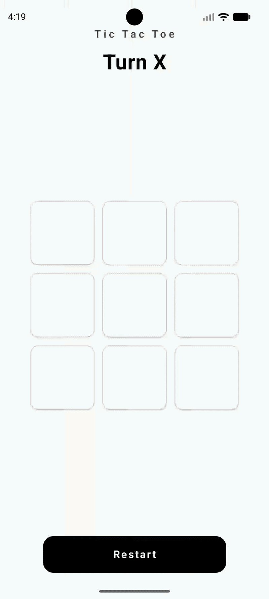

# Tic Tac Toe

A simple Tic Tac Toe game built with Kotlin and Jetpack Compose using the MVVM architecture.

## 🚀 Features

- Responsive UI: Adapts to different screen sizes.
- MVVM Architecture: Uses ViewModel to manage game state and logic.
- Haptic Feedback: Vibrates on cell clicks and game restarts.
- Win Detection: Highlights the winning combination and displays the winner.
- State Management: Handles draws, turns, and game resets.

## 🛠️ Tech Stack

- Kotlin
- Jetpack Compose (UI)
- ViewModel (State Management)
- Material 3 (Design)

## 📂 Project Structure

- `MainActivity.kt`: Entry point of the application.
- `viewmodel/`: Contains `GameViewModel.kt` for core game logic.
- `gameui/`: UI components (`TicTacToeGame`, `Board`, `Cell`).
- `data/`: Data models and enums (`CellState`, `Player`, `GameStatus`).

## 🎮 How to Play

1. Tap an empty cell to place your mark (X starts first).
2. The game automatically detects a win or a draw.
3. Use the Restart button to clear the board and play again.

📸 Game Demo

 
   

